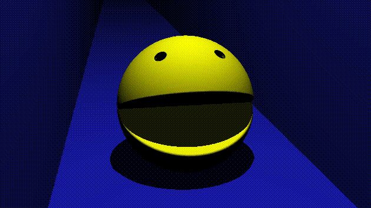

# Pacman

3D Raymarched pacman.

Based on the
[RayMarching: Basic Operators](https://www.youtube.com/watch?v=AfKGMUDWfuE)
tutorial - https://www.shadertoy.com/view/3ssGWj.

Other references:
* [Ray Marching with Unique Colors](https://www.shadertoy.com/view/fdlGWX)
* [Gyroid Tutorial](https://www.shadertoy.com/view/wlKSRc)

Uploaded on ShaderToy at [https://www.shadertoy.com/view/tfBBDd](https://www.shadertoy.com/view/tfBBDd).

